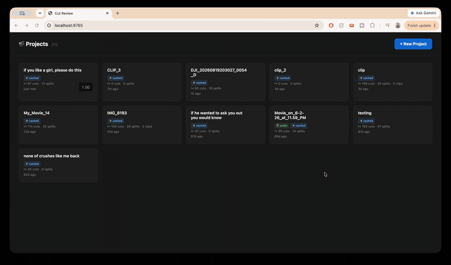

# AI video editor for talking head videos

an AI-assisted video editor i built with Claude, to make editing talking head videos easier & *free*.

when i edited videos for my youtube channel, i kept running into a few problems:

**1) cutting out filler words & bad takes took forever.** every "um," every time i stumbled, every take where i restarted a sentence — i had to sit through the whole recording and cut them one by one.

**2) i was bouncing between a bunch of free tools to do different things.** text effects? i'd export my video to canva. zoom / ken burns? export to imovie. color adjustments? imovie again. i was constantly exporting the same video into different apps, doing one thing, and re-exporting. and I am not willing to pay for any premium software since I'm not making money yet!

**3) adding sound effects was a whole ordeal.** i download viral sound effects off youtube, and every time i want one i have to dig up the file again, re-trim it down to the part i want, and then re-watch my video to find the exact spot to drop it in.

so i built one tool that does it all.  AI finds the filler words and bad takes for me, and everything else — captions, text effects, zoom, sound effects, color — lives in the same place. no more exporting my video five times.

here's everything it does.



## the main idea

you drop in a video, and Claude transcribes it. it writes out everything you said as clickable text, and it automatically deletes the parts worth cutting — filler words, long silences, stutters, and repeat takes. then you skim the transcript and can refine anything that was missed. no need to spend hours listening to your footage and manually editing it.

then, you can add all sorts of standard video editing tools like text captions, image overlays, sound effects, and visual effects. the full list of capabilites is below. no need to switch to other platforms - it's all in one place.

## what it can do

**smart cutting**
- turns your video into a full transcript you can click through — click a word, jump to that moment
- auto-detects filler words, silences, stutters, and repeat takes with Whisper + Claude
- transcript-based editing: delete or undo clips according to the words
- a "hide skipped" view that collapses all the deleted bits so you see only the final cut

**if you record audio separately**
- attach a better mic track and it lines it up with your video automatically
- or drag it into place yourself if you're picky
- you can go back to the camera audio if you change your mind

**text captions & overlays**
- add text anywhere on the video, drag it around, resize it, pick fonts/colors/outlines
- sliders for letter spacing, line spacing, outline thickness 
- **effects**:
- text effects: typewriter, fade, and zoom (with speed sliders)
- ken burns style movement 

**sound effects**
- a **sound library** that saves every sound you add — already trimmed and ready — so you never have to re-find the file or re-trim it again. add it once, reuse it forever in any project
- drop in an mp3 and a little trim screen pops up so you can grab just the part you want (that trimmed version is what gets saved to your library)
- **add a sound by matching it to a word in your transcript** — right-click a word → add sound effect, and it drops in at exactly that moment. so you don't have to re-watch the video hunting for the right spot anymore
- preview any sound before you use it
- volume sliders + mute on every clip

**pictures**
- add image overlays at any timestamp, resize/move them, fade or ken-burns them

**making it look good**
- crop/reframe to 16:9
- brightness, contrast, saturation sliders
- handles iphone HDR footage so your colors don't come out weird

**quality of life stuff**
- smooth playback even with a million cuts (it pre-renders a preview in the background)
- a real timeline with thumbnails, waveforms, and zoom
- pick "standard editing only" if your video is already cut and you just want the editing tools (skips the transcription step, loads instantly)
- export shows a live progress bar, and you can cancel it

## how it's built

it's one python file running a little web server, and the whole editor is the webpage. nothing fancy — flask + plain html/js on the front, and [ffmpeg](https://ffmpeg.org/) doing all the heavy video work behind the scenes. the AI repeat-take detection uses claude.

## running it yourself

you'll need python 3, [ffmpeg](https://ffmpeg.org/), and the python packages below.

```bash
pip install flask anthropic openai-whisper numpy pillow
python3 preview_server.py --port 8765
```

then open http://localhost:8765 and drop in a video (or hit "load video").

for the AI repeat-take detection, set your anthropic api key (everything else works without it):

```bash
export ANTHROPIC_API_KEY=your-key-here
```

## heads up

this is a personal tool i made for my own workflow, so it's a little opinionated and rough around the edges. sharing it in case it's useful or interesting to anyone else :)
